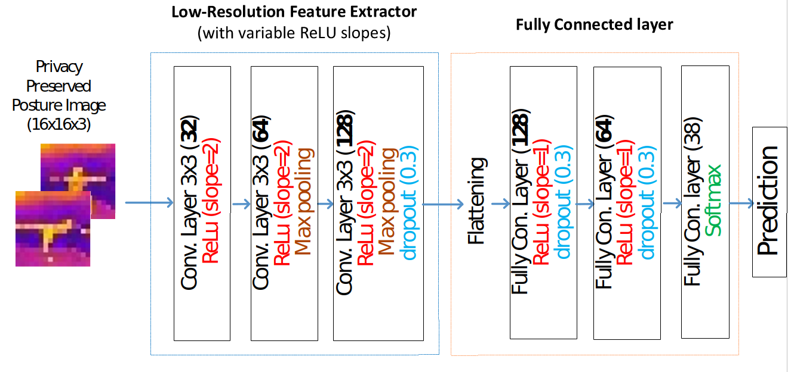
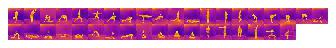
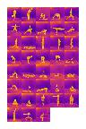

# LowNet

Implementation of our ICIP 2020 paper "Lownet: privacy preserved Ultra-Low Resolution Posture Image Classification"

In this project, we created LowNet architecture, which is suitable for low resolution image classification. 
We are releasing TIP38(Thermal Image Posture 38 class) yoga posture image dataset captured by thermal camera.
<p align = "center">

</p>
<!--

-->

## Custom loss : 


```
 $ L= sum from {i=1} to {N} {{α left (1- {widehat {y}} rsub {i} right )} ^ {β} { y} rsub {i } log left ({{y} rsub {i}} over {{widehat {y}} rsub {i}} right )} $
```
## Datasets

A total of 23 volunteers, 6 males and 17 females were recruited, for the collection of posture dataset. Table 1 represents the statistics (maximum, minimum, mean, and standard deviation) of volunteers’ age, height, weight, and BMI. The volunteers were asked not to wear shoes while performing the yoga poses on a 1.27 cm thick foam floor mat. All the volunteers, except one (ID:117), were wearing T-shirts, pants or shorts.
Fig. 3 shows seven of 38 postures we adopted in this study. The upper row displays 64×64 cropped images from the original infrared images. These images cropped were further down-sampled to 16×16 posture images to serve as ultra-low-resolution training data for the LowNet model.
These ultra-low-resolution images effectively prevent the leakage of personal identification, thwart the invasion of privacy, and reduce the sensor unit cost. These input images were enlarged 8 times for the ease of observation and shown in the second row.
The volunteers performed each posture for 10 seconds in front of the infrared camera where no other human or hot objects were present in the background and the room temperature was 23-25 °C. Among the postures, 11 of them had two versions, e.g., Half-moon posture has two versions, i.e., one with the right leg raised and the other with the left 
leg raised. Different versions of the same posture were considered as one class. Moreover, we adopted three versions of faint posture, i.e., facing up, down, and side.
Due to the level of body flexibility and muscle strength of the individual volunteers, some volunteers couldn’t perform the postures correctly as shown in Fig. 4. Five images were extracted every two seconds from each 10 seconds long posture video. We randomly chose 25 samples from each class to create a balanced dataset. Thus, a total of 4374 samples employed in the dataset where there were 115 samples for each posture. Then the dataset is divided into a training_set and a test_set, which are consisting of samples of 18 (3420 samples) and 5 (954 samples) people, respectively, where each person’s data belongs to only of the sets.

<!--

-->
#### 64x64 resolution images


#### 16x16 resolution images

<!--

-->


# Our paper

If you found this repository useful, please cite our paper
```
@InProceedings{Munhjargal_2020_ICIP,
  author = {Munkhjargal Gochoo, Tan-Hsu Tan, Fady Alnajjar, Jun-Wei Hsieh, and Ping-Yang Chen},
  title = {Lownet: privacy preserved Ultra-Low Resolution Posture Image Classification},
  booktitle = {The IEEE International Conference on Image Processing (ICIP)},
  month = {Oct},
  year = {2020}
}
```
