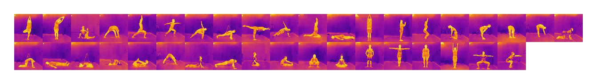
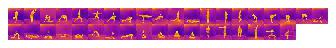

# LowNet

Implementation of our ICIP 2020 paper "Lownet: privacy preserved Ultra-Low Resolution Posture Image Classification"

In this project, we created LowNet architecture, which is suitable for low resolution image classification. 
We are releasing TIP38(Thermal Image Posture 38 class) yoga posture image dataset captured by thermal camera.
<p align = "center">

</p>
<!--

-->

## Custom loss : 


```
 $ L= sum from {i=1} to {N} {{α left (1- {widehat {y}} rsub {i} right )} ^ {β} { y} rsub {i } log left ({{y} rsub {i}} over {{widehat {y}} rsub {i}} right )} $
```
## Datasets

<!--

-->
#### 64x64 resolution images


#### 16x16 resolution images

<!--

-->


# Our paper

If you found this repository useful, please cite our paper
```
@InProceedings{Munhjargal_2020_ICIP,
  author = {Munkhjargal Gochoo, Tan-Hsu Tan, Fady Alnajjar, Jun-Wei Hsieh, and Ping-Yang Chen},
  title = {Lownet: privacy preserved Ultra-Low Resolution Posture Image Classification},
  booktitle = {The IEEE International Conference on Image Processing (ICIP)},
  month = {Oct},
  year = {2020}
}
```
